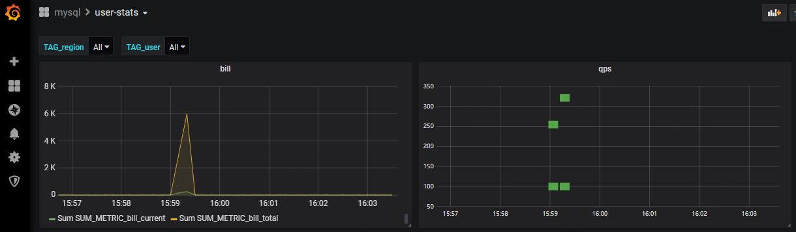

本项目的目的在于简化grafana的使用，根据数据格式自动生成grafana图表.

# 1. es索引数据

## 1.1 数据格式
数据格式要求json,要求只有一层,对key如下规范：
- service,必须字段，标识服务
- model：必须字段，区分不同类型metric
- @timestamp:必须字段，时间戳,格式"2019-01-01T01:00:00+08:00"
- TAG_xxx:自定义字段，用于筛选，xxx可以自定义，要求多余一个
- xxx_METRIC_xxx:表示panel中的监控指标,可以多余一个,一共可以定义以下几种格式
   - METRIC_xxx/GRAPH_METRIC_xxx:表示该metric生成graph类型的panel，并且metric的聚合方式为avg
   - SUM_METRIC_xxx/GRAPH_SUM_METRIC_xxx:表示该metric生成graph类型的panel，并且metric的聚合方式为sum
   - HEATMAP_METRIC_xxx:表示该metric生成heatpmap类型的panel，默认metric的聚合方式为max

示例：
```
{"service":"mysql", "model":"user-stats", "@timestamp":"", "TAG_region":"hb", "TAG_user":"tom", "SUM_METRIC_bill_current":100, "SUM_METRIC_bill_total":6000, "HEATMAP_METRIC_qps_current":100, "HEATMAP_METRIC_qps_total":250}

{"service":"mysql", "model":"resouce-stats", "@timestamp":"", "TAG_region":"hb", "TAG_user":"mary", "METRIC_cpu":10}
```
## 1.2 es索引

index名字,xxxx为年月,按照年月进行切分  
- grafana--{service}-{model}-xxxx

index mapping  
- TAG_xxx自动创建为keyword
- xxx_METRIC_xxx自动创建为long

index template:创建index时的schema
- [template.sh](./template.sh)

# 2. grafana图表

## 2.1 dashboard生成规则

- service: folder,用于组织管理dashboard
- model: dashboard,一个model会生成在service下的一个dashboard

## 2.1 绘制graph规则

- @timestamp作为横轴。  
- TAG_xxx: 绘制成下拉框，用于选择, 支持TAG_xxx排序和搜索级联. 
- xxx_METRIC_xxx: 会变成纵轴的值
   - 以METRIC_/GRAPH_METRIC_开头的metric聚合方式为Average
   - 以SUM_METRIC_/GRAPH_SUM_METRIC_开头的metric聚合方式为sum
- 支持两种panel类型：graph和heatmap
   - 以METRIC_或GRAPH_METRIC_开头的metric会生成graph类型的panel
   - 以HEATMAP_METRIC_开头的metric会生成heatmap类型的panel
   - 默认情况下，有相同前缀的METRIC会合并到一个panel中,例如:
      - METRIC_bill_current和METRIC_bill_total会放置在title为bill,类型为graph的同一个panel里
      - HEATMAP_qps_current和HEATMAP_qps_total会放置在title为qps,类型为heatmap的同一个panel里
   - 如果想定制panel中的metric, 需要指定Es2Grafana中的myPanels参数


# 3. 架构推荐
```
            filebeat            es-store        es2grafana
local disk------------->kafka------------->es----------------->grafana
```

# 4. example  

自己部署好es和grafana后  

```
go build main/es-store.go
go build main/es2grafana.go

#create template
export ESDOMAIN=localhost:9200
./template.sh

#index document
./es-store -es='http://localhost:9200' -doc='{"service":"mysql", "model":"user-stats", "@timestamp":"", "TAG_region":"hb", "TAG_user":"tom", "SUM_METRIC_bill_current":100, "SUM_METRIC_bill_total":6000, "HEATMAP_METRIC_qps_current":100, "HEATMAP_METRIC_qps_total":250}' 

#generate grafana graph
./es2grafana -es='http://localhost:9200' -service='mysql' -model='user-stats' -grafana='http://localhost:3000' -key='admin:biliucheng'

```

grafana结果图片  



# 5. API  
```

```

# 6. 一些问题

在开发过程中，grafana的文档很不友好，也不全面。另外也没有一个很好用的library。
这里使用并fork了golang的库https://github.com/grafana-tools/sdk, 新代码https://github.com/bilc/grafana-sdk， 其中增加了一些功能。  
一个有用的json转golang struct的网站：https://mholt.github.io/json-to-go/。

由于文档不够全面，很难正向开发拼接参数请求grafana。   
**我的方法是先在grafana上配置好dashboard，生成对应的json，在代码中对这段json反序列化，生成一个基本的dashboard结构，然后用代码去修改需要动态生成的变量。**


